# SaaS Platform — Modern Next.js Application

A modern, full-featured **Software as a Service (SaaS)** platform built with **Next.js 16**, **React 19**, **TypeScript**, and **Tailwind CSS**. This comprehensive application includes user authentication, interactive dashboard, and professional landing pages.

## 🌟 Key Features

### 🎨 Landing & Marketing Pages

- **Interactive Homepage**: Dynamic background with gradient effects, grid lines, and animated elements for a premium feel
- **Professional Pricing Page**: Showcase your service offerings and monetization plans
- **Comprehensive FAQ Section**: Address common customer questions with clear, organized content
- **Testimonials Page**: Display customer success stories and social proof
- **Coming Soon Page**: Build anticipation for upcoming features
- **Sleek Auth Pages**: Professional-grade Login and Registration screens with form validation

### 📊 Dashboard & User Management

- **Protected Routes**: Client-side routing with authentication checks and automatic redirects
- **Dynamic Sidebar Navigation**: Seamless navigation between dashboard sections, user profile, and settings
- **User Management**:
  - Fetch and display real user data from JSONPlaceholder API
  - Detailed user profile modal views
  - Real-time data processing and display
- **Activity Overview**: Key metrics and analytics cards with dynamic data visualization
- **User Settings**:
  - Profile customization (Name, Email)
  - User preferences management
  - Secure logout functionality

### 🌓 Theme & Personalization

- **Dark/Light Mode Toggle**: Full theme switching with persistent preferences via `localStorage`
- **Responsive Design**: Mobile-first approach ensuring great experience on all devices
- **Consistent Branding**: Custom Google Fonts (Poppins, Geist) applied across the application

## 🛠️ Tech Stack

| Category | Technology | Version |
|----------|-----------|---------|
| **Framework** | [Next.js](https://nextjs.org/) | 16.1.6 |
| **UI Library** | [React](https://react.dev/) | 19.2.3 |
| **Language** | [TypeScript](https://www.typescriptlang.org/) | 5 |
| **Styling** | [Tailwind CSS](https://tailwindcss.com/) | 4 |
| **CSS Processing** | [PostCSS](https://postcss.org/) | 4 |
| **Linting** | [ESLint](https://eslint.org/) | 9 |
| **Data** | [JSONPlaceholder API](https://jsonplaceholder.typicode.com/) | (Mock Data) |
| **Auth** | LocalStorage | (Demo Mode) |

## 📦 Installation & Setup

### Prerequisites

- **Node.js**: 18.0.0 or higher
- **npm**: 9.0.0 or higher (or yarn/pnpm)
- **Git**: For version control

### Quick Start

```bash
# 1. Clone the repository
git clone https://github.com/yourusername/saas-platform.git
cd saas-main

# 2. Install dependencies
npm install

# 3. Start the development server
npm run dev
```

Open [http://localhost:3000](http://localhost:3000) in your browser to see the application.

## 🚀 Available Scripts

```bash
# Development - Hot reload enabled
npm run dev

# Production Build - Optimized bundle
npm run build

# Production Server - Run built application
npm start

# Linting - Check code quality
npm run lint
```

## 📂 Project Structure

```
saas-main/
├── app/                           # Next.js App Router
│   ├── layout.tsx                # Root layout + global styles
│   ├── page.tsx                  # Landing homepage
│   ├── globals.css               # Global CSS variables
│   ├── login/                    # Login page
│   │   └── page.tsx
│   ├── register/                 # Registration page
│   │   └── page.tsx
│   ├── dashboard/                # Protected dashboard
│   │   ├── layout.tsx            # Dashboard layout with sidebar
│   │   ├── page.tsx              # Dashboard overview with metrics
│   │   ├── settings/             # User settings page
│   │   └── user/                 # User profile page
│   ├── pricing/                  # Pricing page
│   ├── faq/                      # FAQ section
│   ├── testimonials/             # Customer testimonials
│   ├── coming-soon/              # Coming soon preview
│   └── images/                   # Image assets
├── components/                    # Reusable React components
│   ├── Sidebar.tsx               # Navigation sidebar
│   ├── ThemeToggle.tsx           # Dark/Light mode toggle
│   └── UserModal.tsx             # Reusable modal component
├── public/                        # Static assets
│   └── images/
├── package.json                  # Dependencies & scripts
├── tsconfig.json                 # TypeScript configuration
├── next.config.ts                # Next.js configuration
├── tailwind.config.js            # Tailwind CSS configuration
├── postcss.config.mjs            # PostCSS configuration
├── eslint.config.mjs             # ESLint configuration
└── README.md                      # This file
```

## 🔐 Authentication System

The application uses **localStorage-based authentication** for demonstration purposes:

- **Registration**: Store user credentials in localStorage
- **Login**: Validate credentials against stored users
- **Protected Routes**: Client-side checks redirect unauthenticated users
- **Logout**: Clear session and redirect to login

### ⚠️ Production Considerations

For production deployments, implement:
- **Proper Backend API** with secure authentication
- **Authentication Services**: Auth0, Firebase, Supabase, or similar
- **Secure Password Handling**: Hash and salt passwords (bcrypt, argon2)
- **JWT/Session Management**: Secure tokens with httpOnly cookies
- **HTTPS/TLS**: Encrypted communication
- **CSRF Protection**: Cross-site request forgery prevention

## 📱 Pages Overview

| Page | Route | Purpose |
|------|-------|---------|
| Home | `/` | Landing page with marketing content |
| Login | `/login` | User authentication |
| Register | `/register` | New user registration |
| Dashboard | `/dashboard` | Main application dashboard with metrics |
| Settings | `/dashboard/settings` | User preferences & profile settings |
| User Profile | `/dashboard/user` | User information and details |
| Pricing | `/pricing` | Service pricing plans |
| FAQ | `/faq` | Frequently asked questions |
| Testimonials | `/testimonials` | Customer testimonials |
| Coming Soon | `/coming-soon` | Upcoming features preview |

## 📸 Screenshots

### Landing Page
The beautiful landing page with "Squid" branding, featuring a modern dark theme with gradient buttons and animated background elements.

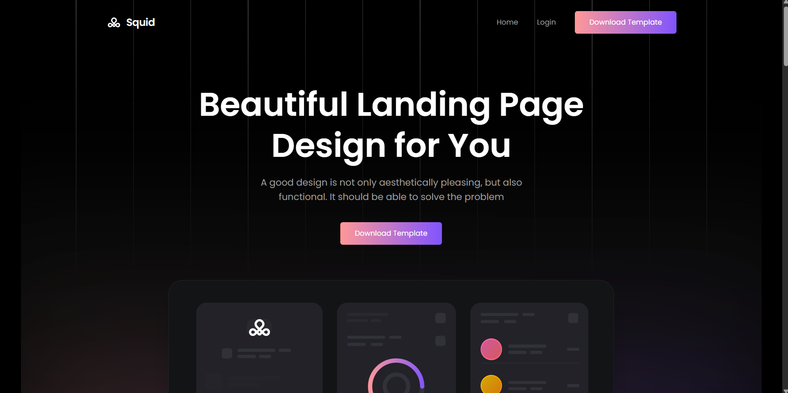

### Homepage with Contact Form
Complete homepage view showing the contact form section with globe graphic and navigation menu with "Home", "Login", and "Download Template" buttons.

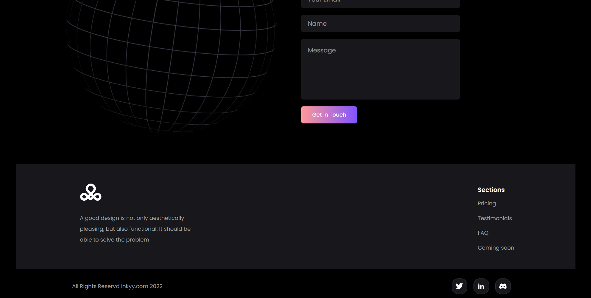

### Registration Page
User registration form with fields for Full Name, Email, Password, and Repeat Password, along with social authentication options (Google & Twitter).

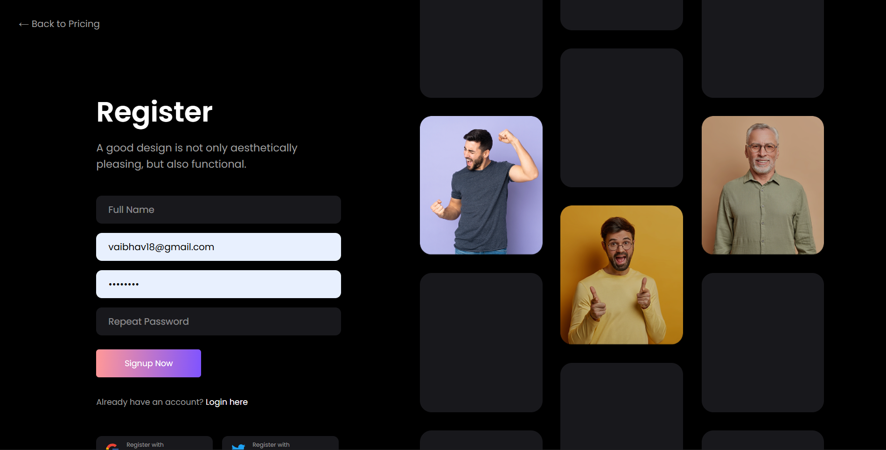

### Login Page
Professional login interface with email and password fields, featuring demo credentials (vaibhavi8@gmail.com), login button, and registration link with social login options.

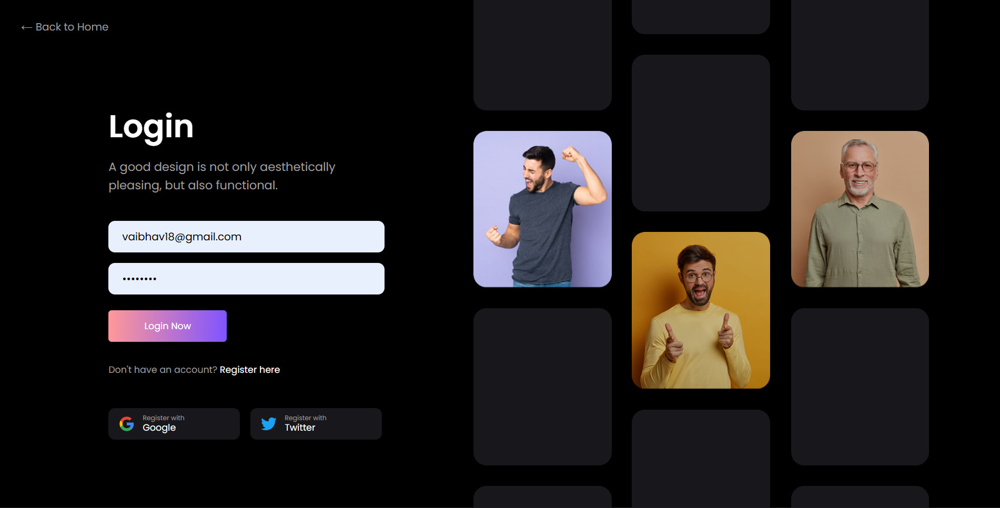

### Dashboard - Users Management
Complete user management interface showing a list of users with search functionality, sorting options (Sort A-Z), and detailed user information including name, email, and company.

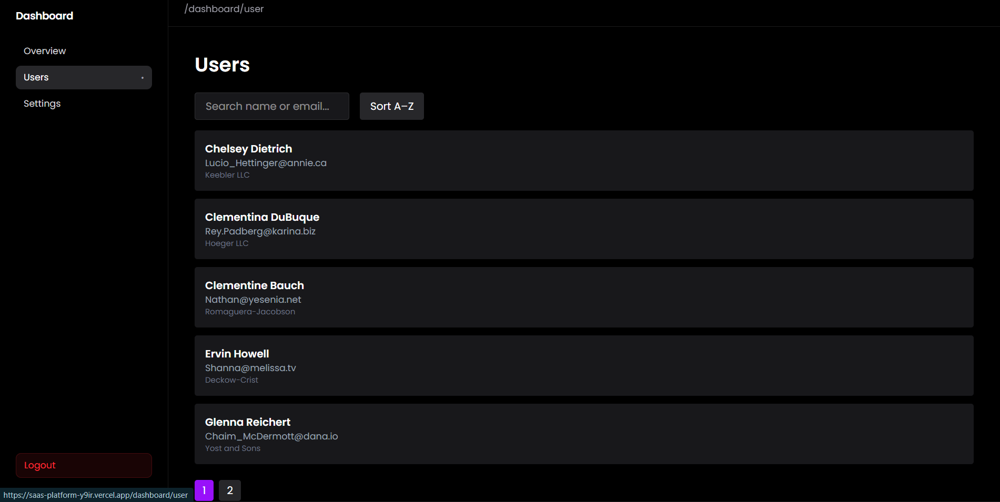

### Dashboard - Overview
Dashboard overview page displaying key metrics in cards:
- Total Users: 10
- Companies: 10
- Email Domains: 10
- Websites: 10

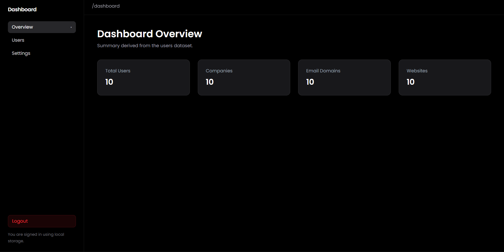

### Dashboard Settings
User settings page with profile customization options including:
- Display Name field
- Email field
- Dark/Light mode toggle
- Save Changes button

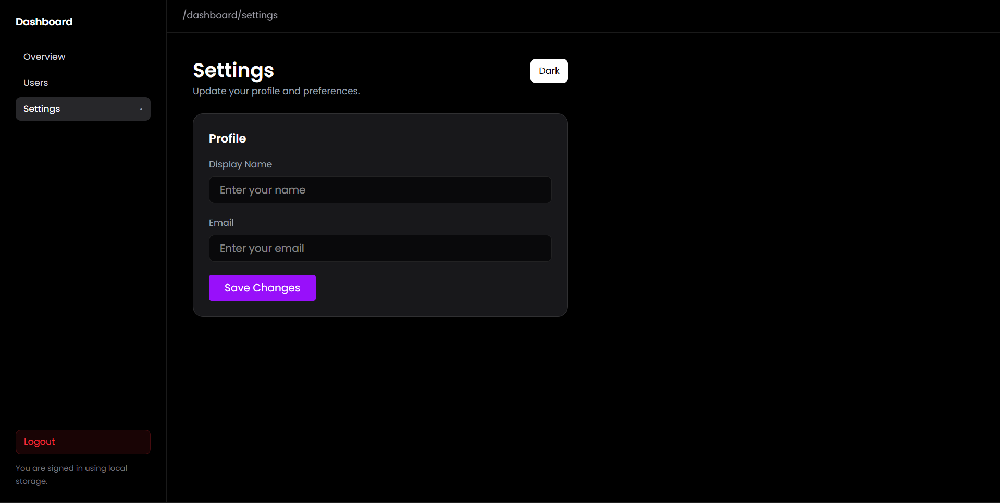

### Pricing Page - Monthly Plan
Professional pricing page showing three service tiers:
- Silver Package: $40/month
- Golden Package: $70/month
- Premium Package: $120/month

Each package includes features like free templates, team members, priority support, and integrations.

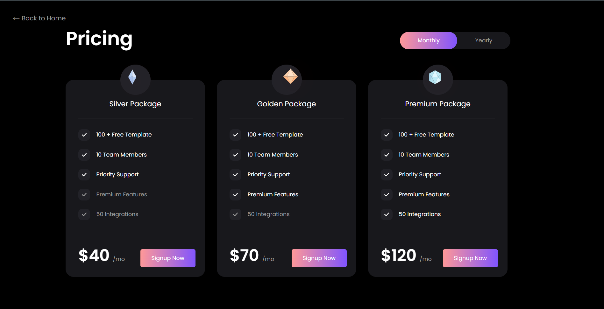

### Pricing Page - Yearly Plan
Same pricing page switched to yearly billing with discounted rates:
- Silver Package: $32/month (annually)
- Golden Package: $56/month (annually)
- Premium Package: $96/month (annually)

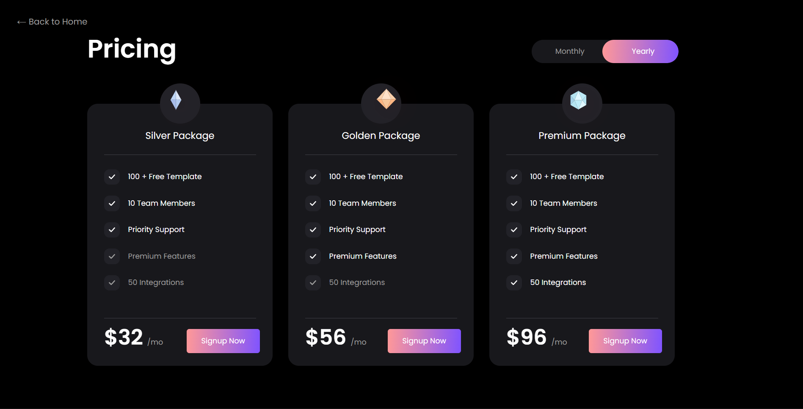

### Register Page with Testimonials
Registration page showcasing customer testimonials on the right side with profile pictures, featuring three visible testimonial cards from happy customers.

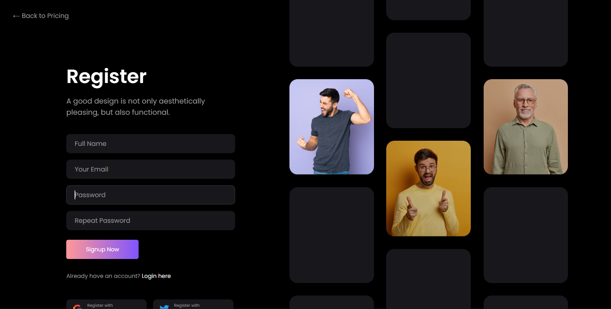

### Testimonials Page
Full testimonials section displaying carousel of customer reviews with 5-star ratings, customer names, and their company affiliations. Smooth sliding carousel with pagination dots.

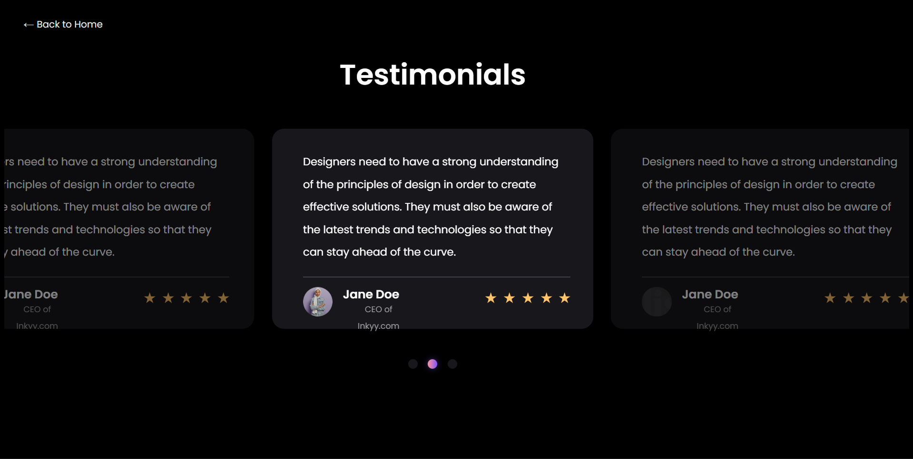

### FAQ Page
Comprehensive Frequently Asked Questions section with expandable accordion items covering:
- How to use this template?
- What are your shipping rates?
- What is your refund policy?
- How can I track my order?
- I received the wrong item, what do I do?
- What are benefits of this template?
- Best web design agency ever is?
- How can I order web design services?
- How promote the product?

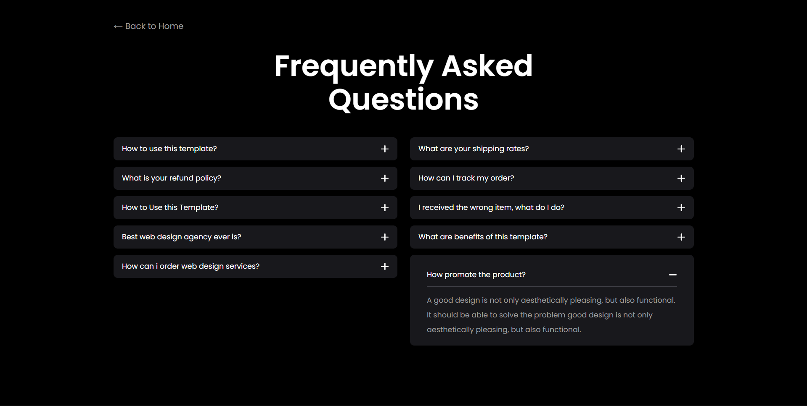

### Coming Soon Page
Coming soon preview page highlighting upcoming features:
- Inner Pages
- 40+ Sections
- HTML/CSS Version

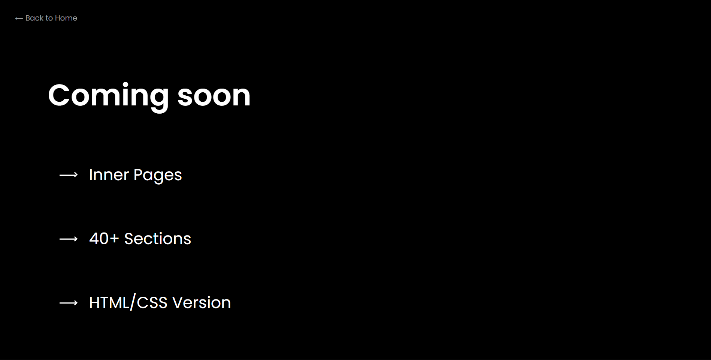

## 🎨 Component Library

### Sidebar
- Main navigation component for dashboard
- Links to Overview, User Profile, and Settings
- Responsive design with mobile support
- Integrates ThemeToggle for dark mode

### ThemeToggle
- Switches between dark and light themes
- Persists preference in localStorage
- Updates CSS custom properties globally
- Smooth transitions between themes

### UserModal
- Reusable modal for displaying user details
- Fetches data from JSONPlaceholder API
- Customizable content and styling
- Close on overlay click or button

### MetricCard
- Displays key performance indicators
- Shows label and numeric values
- Responsive grid layout
- Dark mode support

## 🌐 API Integration

The dashboard integrates with **JSONPlaceholder** (mock API) for demonstration:

```typescript
// Fetches user data
const users = await fetch('https://jsonplaceholder.typicode.com/users')
  .then(res => res.json())
```

For production, replace with your actual API endpoints.

## 🎨 Styling & Design

- **Tailwind CSS v4**: Utility-first CSS framework
- **Dark Mode**: Full dark/light theme support
- **Responsive**: Mobile-first, works on all screen sizes
- **Custom Fonts**: Poppins (primary), Geist Sans/Mono (fallback)
- **CSS Variables**: Theme system for easy customization
- **Gradient Effects**: Premium-looking gradients and blur effects

## 🧪 Development Workflow

```bash
# Make changes in /app or /components
npm run dev

# Check for linting errors
npm run lint

# Build for production
npm run build

# Test production build locally
npm start
```

## 📊 Data Flow

```
User Input (Forms) 
    ↓
Components (React)
    ↓
State Management (localStorage/useState)
    ↓
API Calls (JSONPlaceholder/Backend)
    ↓
Dashboard Display
```

## 🚀 Deployment

### Vercel (Recommended)

```bash
# 1. Push to GitHub
git add .
git commit -m "Initial commit"
git push origin main

# 2. Connect to Vercel
# Visit https://vercel.com/new and connect your repository
# Vercel will auto-detect Next.js and deploy automatically
```

### Other Platforms

**Netlify**
```bash
npm run build
# Deploy the `out` folder
```

**Docker**
```dockerfile
FROM node:18-alpine
WORKDIR /app
COPY package*.json ./
RUN npm install
COPY . .
RUN npm run build
EXPOSE 3000
CMD ["npm", "start"]
```

**Traditional Hosting** (Node.js server)
```bash
npm run build
npm start
# Application runs on port 3000
```

## 🔍 Debugging & Development

- **TypeScript**: Type safety catches errors at compile time
- **ESLint**: Enforces code quality standards
- **Browser DevTools**: Debug client-side code
- **VS Code**: Optimal development experience with TypeScript support

## 📝 Environment Variables (Future)

For future integration with external services:

```env
NEXT_PUBLIC_API_URL=https://api.example.com
NEXT_PUBLIC_APP_URL=https://app.example.com
API_SECRET_KEY=your_secret_key
```

## 🤝 Contributing

Contributions are welcome! Here's how to get started:

```bash
# 1. Fork the repository
# 2. Create a feature branch
git checkout -b feature/amazing-feature

# 3. Make your changes and commit
git commit -m 'Add amazing feature'

# 4. Push to your fork
git push origin feature/amazing-feature

# 5. Open a Pull Request
```

## 📄 License

This project is open source and available under the **MIT License**. See LICENSE file for details.

## 🔗 Useful Resources

- [Next.js Documentation](https://nextjs.org/docs)
- [React Documentation](https://react.dev)
- [Tailwind CSS Guide](https://tailwindcss.com/docs)
- [TypeScript Handbook](https://www.typescriptlang.org/docs/)
- [JSONPlaceholder API](https://jsonplaceholder.typicode.com/)

## 📞 Support & Contact

- **Issues**: Open an issue on GitHub for bugs or feature requests
- **Discussions**: Use GitHub Discussions for questions
- **Email**: [contact information if applicable]

## 🙏 Acknowledgments

Built with modern web technologies and best practices for rapid SaaS development.

---

**Start building amazing SaaS products today!** ✨
